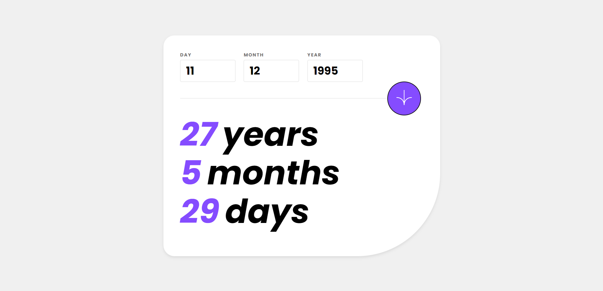
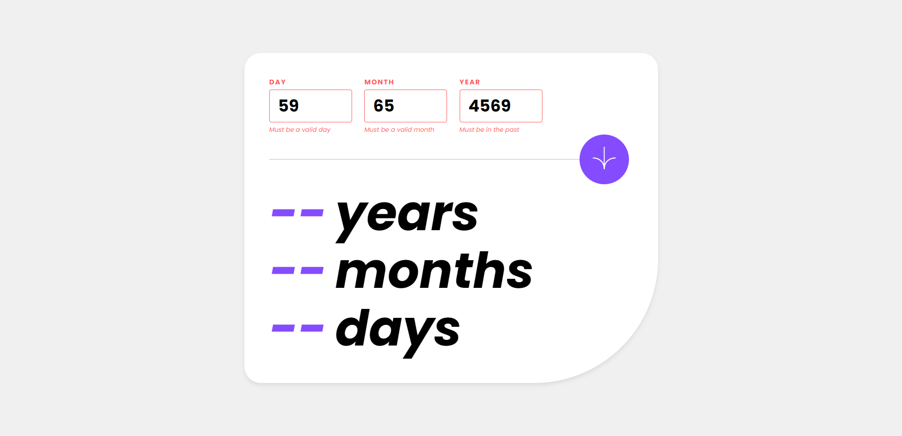
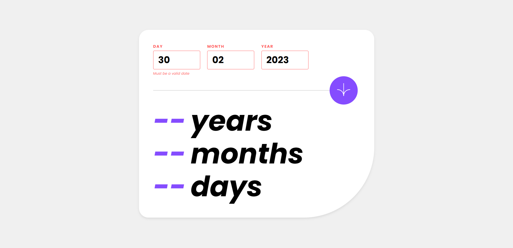
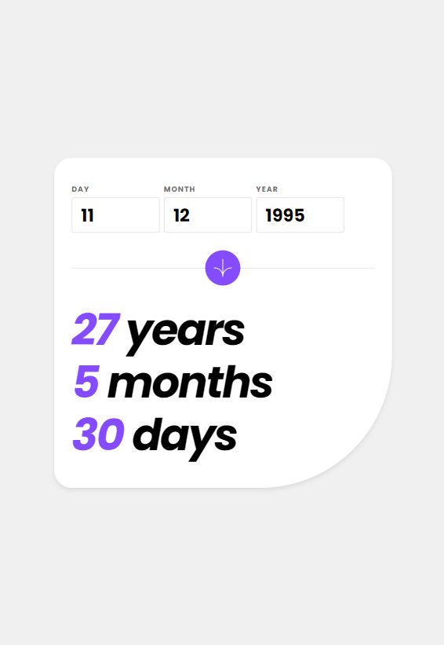
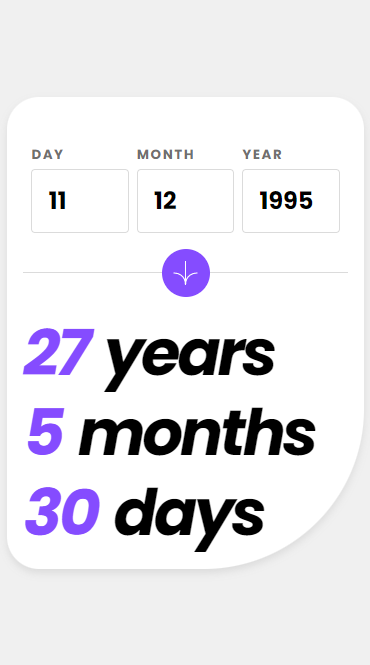

# Age Calculator

## Overview

This project calculates the age (years, months, days) based on the date provided. It validates the input for the following conditions:

- If the day, month, and year provided are valid (in the past and within range)
- If the date exists (not Feb 30th for example)
- If required fields were provided

## Technologies

This project was built with the following technologies:

-  TypeScript
-  React
-  Vite
-  Styled components
- **react-hook-forms** and **zod** for validation

## Installation

To use this project, simply clone or download the repository to your local machine and run the following commands:

`npm install` to install dependencies

`npm run dev` to start the server

## Usage

Enter the birth date in the input fields for day, month, and year.
Click the down arrow button (submit button) to see the result.
The result will be displayed in the format of "x years, y months, z days".

## Validations

The input is validated for the following conditions:

- If all fields are filled up: The input fields cannot be empty.

- If the day, month, and year provided are valid: The date provided must be in the past and within range.
  - Days must be within 1-31 range
  - Months must be within 1-12 range
  - Year must be equal or before current year

- If the date exists: The date provided must exist. For example, February 30th is not a valid date.

## Example

Suppose the birth date is May 9th, 2000 and current date is May 9th 2023. The user will input "09" in the day field, "05" in the month field, and "2000" in the year field. Then, click the "Calculate Age" button. The result will be displayed as "23 years, 0 months, 0 days".

## Responsiveness

This app is responsive and can be used on mobile and tablet devices.

### iPad/Tablet

### Mobile

